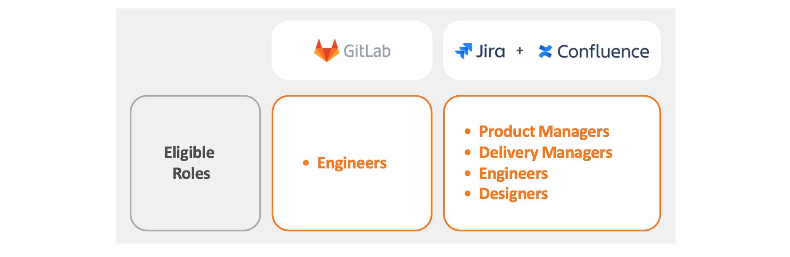

# Eligible Roles and Tools

To  quickly check if you’re eligible for the Product Development Tools, you can use this tool: [**go.gov.sg/product-dev-tools-eligibility**](https://go.gov.sg/product-dev-tools-eligibility).

Central funding will cover specific GovTech staff roles such as **Engineers, Product Managers, Delivery Managers, and Designers**. 

| Roles | Tools |
|---|---|
| Engineers  | GitLab |
| Product Managers, Delivery Managers, Engineers, and Designers | Jira |
| Product Managers, Delivery Managers, Engineers, and Designers | Confluence |

?> **Note:** Vendors and augmented staff (in any role) from Bulk Tender 19024 or 23009 are not eligible. 

For GovTechies who are not part of the pilot initiative, you may write in to the team via Slack at the  [**#feedback-product-development-tools**](https://govtech.enterprise.slack.com/archives/C07UF60HY9Y) channel, and we will review on a case by case basis.