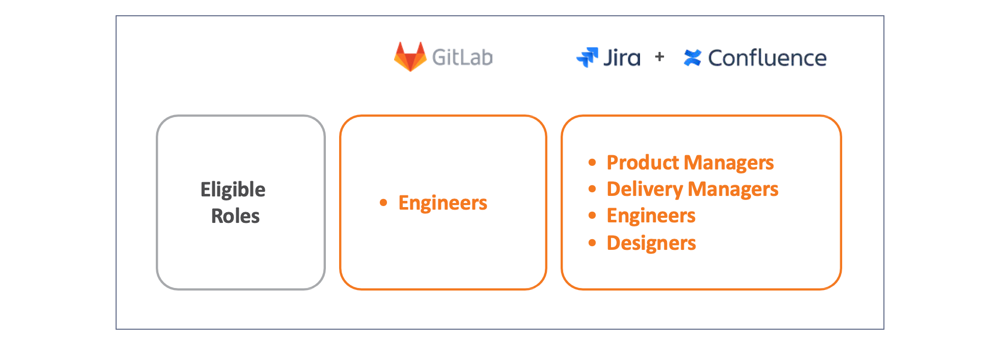

# Eligible Roles and Tools

Central funding will cover specific GovTech staff roles such as **Engineers, Product Managers, Delivery Managers, and Designers** for the pilot implementation. 

<!--

| Roles | Tools |
|---|---|
| Engineers  | GitLab |
| Product Managers, Delivery Managers, Engineers, and Designers | Jira |
| Product Managers, Delivery Managers, Engineers, and Designers | Confluence |

-->

## Eligibility check 

To  quickly check if you’re eligible, you can use this service: [**go.gov.sg/product-dev-tools-eligibility**](https://go.gov.sg/product-dev-tools-eligibility). 

If you're eligible, the tool will display the group you belong to.

| Group | Role | Tools |
|---|---|--|
| Engineering | Engineers  | GitLab, Jira, Confluence |
| Product | Product Managers, Delivery Managers | Jira, Confluence |
| Design | Designers | Jira, Confluence |

?> **Note:** Vendors and augmented staff (in any role) from Bulk Tenders 19024, 23009, or 23069 are not eligible for this initiative. 

💡 **Reminder** 

If you are not eligible for this pilot implementation, you can still continue using these tools with your existing [SHIP-HATS](https://www.developer.tech.gov.sg/products/categories/devops/ship-hats/overview.html) subcription. If you are not an existing SHIP-HATS user, you can sign up via [TechBiz](https://portal.techbiz.suite.gov.sg/) and log in with [TechPass](https://docs.developer.tech.gov.sg/docs/techpass-user-guide/). 

While some individuals may not be eligible for this initial phase, the goal is to expand the initiative over time. Feedback will be essential in making the tools more accessible and useful for a wider audience. Your input will play a key role in shaping future phases of the rollout.

For GovTechies (permanent and contract staff) in the specific roles mentioned above who are not eligible for the pilot, you can reach out to the team via Slack at the  [**#feedback-product-development-tools**](https://govtech.enterprise.slack.com/archives/C07UF60HY9Y) channel, and we will review on a case-by-case basis.

