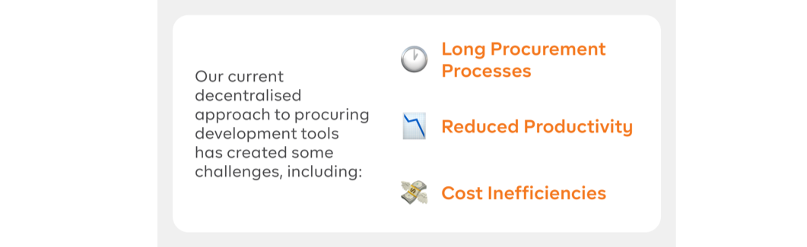

# Product Development Tools

The Product Development Tools initiative aims to simplify and centralise access to essential development tools for GovTech product teams, streamlining workflows, and reducing barriers to productivity.

Launching in FY24, these tools will be made available to eligible GovTechies (permanent and contract staff) upon onboarding, enabling teams to focus on  building impactful products.

This initiative is centrally funded and led by the CIO Office and the Core Engineering Productivity teams, in partnership with [Open Data Access](https://docs.developer.tech.gov.sg/docs/open-data-access/). 

## Why are we doing this?

- **Long procurement processes:** Without central expertise, navigating procurement can be time-consuming.
- **Reduced productivity:** GovTechies transitioning between product teams often face delays in adapting to new tools.
- **Cost inefficiencies:** Decentralisation limits the benefits of bulk purchasing and other cost-saving opportunities.

This initiative seeks to reduce these challenges, so that GovTech engineers and product teams can focus on core activities rather than navigating tool acquisition and budgeting processes.

## What does this initiative offer?

In collaboration with the CIO Office and Core Engineering Productivity teams, we are introducing a standardised suite of tools that will be centrally provisioned for eligible roles within GovTech product teams. Here’s what the pilot includes:

- **Standardised Tools:** A consistent set of development tools will be available for all eligible roles, helping create a seamless experience across teams.
- **Centralised Provisioning:** The CIO Office will manage tool provisioning, allowing product teams to focus on core work.
- **Financial Optimisation:** By consolidating procurement, we can leverage bulk purchasing for cost savings for GovTech.

<!-- 

## What is changing?

GovTechies used to subscribe via TechBiz to get access to product development tools such as GitLab, Jira and Confluence. With this initiative to centralise Product Development Tools, [eligible  GovTechies](/eligibility.md) will be moved into a Central GovTech subscription managed by CIO office. This subscription will be managed via automation, enabling new GovTechies in eligible roles to have default access to these tools from the day they onboard.

GovTechies who are existing subscribers will be moved to a Central GovTech subscription for **Product Development Tools (GitLab, Jira, and Confluence)**, while GovTechies who are not existing subscribers will be granted access to these tools to support their product development work. Only GovTechies in eligilble roles and teams would be part of this initiative during the pilot rollout.

While we would have loved to extend this to all GovTechies, we’re rolling out the initial pilot for Product Development teams within GovTech. If you would like to raise any feedback or questions, please reach out to the team via Slack at [**#feedback-product-development-tools**](https://govtech.enterprise.slack.com/archives/C07UF60HY9Y). 

-->

## Learn more

For more details, refer to the following sections:
- [Which are the eligible roles?](/eligibility.md)
- [How will this pilot work and what do you need to do?](/implementation.md)
- [Support and FAQs](/support.md)
